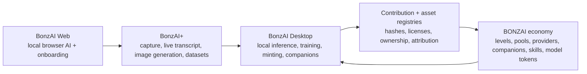

# Welcome to BonzAI

BonzAI is a local-first AI product suite and onchain economy. It combines private browser AI, a browser extension for capture and dataset creation, a desktop production studio, autonomous AI companions, P2P inference, creator minting, and contribution-based rewards.

The product suite has three main surfaces:

| Product | What it does | Where it fits |
| --- | --- | --- |
| **BonzAI Web** | Local browser chat and public product surface | The front door for private AI, onboarding, downloads, and product education |
| **BonzAI+** | Browser assistant extension with Chat, Live, Imagine, and Dataset modes | Captures useful text, images, video context, generated images, and metadata from the web |
| **BonzAI Desktop** | Electron studio for local inference, training, minting, companions, P2P, and onchain actions | Turns local AI work into datasets, models, assets, companion identities, and rewards |

BonzAI is not just "a local model app." The long-term primitive is **Proof-of-Contribution AI**: useful AI assets should carry provenance, ownership, quality signals, and reward routes from the moment they are captured to the moment they are trained, generated, minted, served, or reused.

## Core Principles

- **Local-first AI**: Generation runs on the user's machine or browser whenever the selected product and device support it.
- **Free generation**: BONZAI levels do not gate normal generation. Levels gate minting rights, participation, publishing, and economic surfaces.
- **User-owned outputs**: Users can keep work private, export it, mint it, publish it, or route it into training workflows.
- **Contribution provenance**: Dataset samples, evaluations, model adapters, generated assets, provider time, and companion actions can become signed contribution records.
- **Onchain rewards**: Revenue can flow through mint pools, provider-side pool shares, companion token hooks, skill co-ownership, model/fine-tune tokens, and future contribution registries.

## Storage Policy

BonzAI does **not** use Irys at all. When content or metadata must be published off-device, the current product documentation assumes IPFS pinning through Pinata or another IPFS-compatible path configured by the app. If older source names or variables mention Irys, treat them as legacy naming only, not as the active storage architecture.

## Read This First

- To understand the products, start with [Product Suite](products/README.md).
- To understand real user flows, start with [Scenario Map](user-scenarios/README.md).
- To understand token levels and rewards, start with [Reward Structure & Epochs](web3/reward-structure.md).
- To understand the new economic thesis, start with [Proof-of-Contribution AI](proof-of-contribution/README.md).
