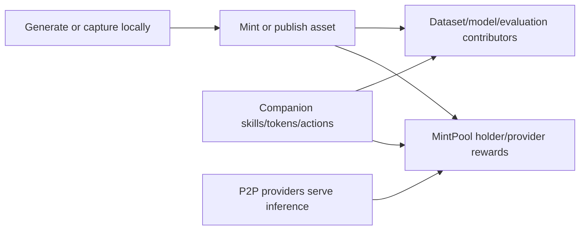

# Web3 & Onchain Economy

BonzAI's Web3 layer turns local AI work into ownable, reusable, and rewardable assets. The token is not needed for ordinary generation. It coordinates minting rights, pool eligibility, provider rewards, companion economics, model/fine-tune tokens, skills, and future contribution registries.

## Core Assets

| Asset | Purpose |
| --- | --- |
| BONZAI token | Level thresholds, pool eligibility, curation/reputation weight, provider requirements |
| Content NFTs | Minted text, audio, image, video, 3D, and training assets |
| Companion NFTs | ERC-721 + ERC-8004 AI companion identity |
| Companion tokens | ERC-20 tokens launched for companions with Uniswap V4 liquidity |
| Fine-tune/model tokens | ERC-20 tokens launched around training/model assets |
| Contribution records | Hashes, licenses, provenance, and attribution for useful AI work |

## Economy Loop

## Networks

BonzAI is multi-chain and configuration-driven. The BONZAI token exists on Ethereum, Arbitrum, and Base. App contracts can be deployed/configured per environment. LUKSO is used for optional Universal Profiles, not as a blanket replacement for minting and payment flows.

## Read Next

- [BONZAI Token & Levels](token-levels.md)
- [Reward Structure & Epochs](reward-structure.md)
- [Content NFTs](content-nfts.md)
- [Smart Contracts](smart-contracts.md)
- [Uniswap V4 Hooks](uniswap-hooks.md)
