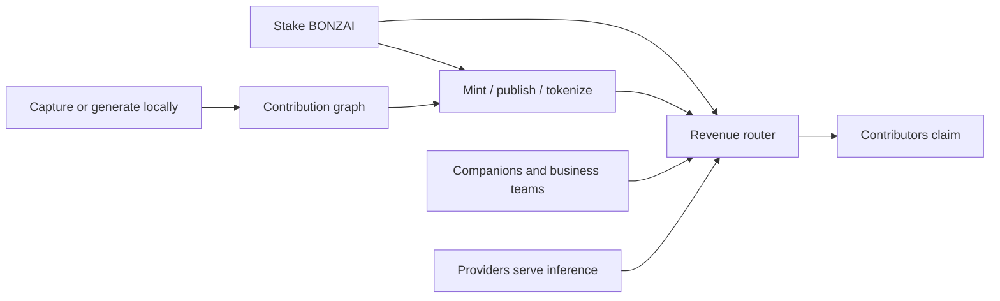

# Web3 & Onchain Economy

BonzAI's Web3 layer turns local AI work into ownable, reusable, and rewardable assets.

The important point: `$BONZAI` is not there to charge users for every prompt. It is there when private work becomes something shared, published, minted, served, sold, hired, or rewarded.

Start with [$BONZAI Utility](bonzai-utility.md), then read [Staking Architecture](staking-architecture.md).

## Core Assets

| Asset | Purpose |
| --- | --- |
| BONZAI token | Staked utility weight for publishing, routing, curation, provider trust, companion/company reputation, and rewards |
| Staking position | The user's committed network weight: amount, lock, contribution score, utility tier |
| Revenue routes | Immutable provenance-based shares plus a separate staking bonus |
| Content NFTs | Minted text, audio, image, video, 3D, and training assets |
| Companion NFTs | ERC-721 + ERC-8004 AI companion identity |
| Companion tokens | ERC-20 tokens launched for companions with Uniswap V4 liquidity |
| Fine-tune/model tokens | ERC-20 tokens launched around training/model assets |
| Contribution records | Hashes, licenses, provenance, and attribution for useful AI work |

## Economy Loop



## Networks

BonzAI is multi-chain and configuration-driven. The BONZAI token exists on Ethereum, Arbitrum, and Base. App contracts can be deployed/configured per environment. LUKSO is used for optional Universal Profiles, not as a blanket replacement for minting and payment flows.

## Transitional Systems

Older level, unlock, and MintPool mechanics may still exist in deployed contracts and product screens. They are compatibility rails. The strategic model is staking-centered:

```text
contribution + staked BONZAI + usage = ownership and rewards
```

## Read Next

- [Levels & Utility](token-levels.md)
- [$BONZAI Utility](bonzai-utility.md)
- [Staking](staking-architecture.md)
- [Rewards & Revenue Share](reward-structure.md)
- [Content NFTs](content-nfts.md)
- [Smart Contracts](smart-contracts.md)
- [Uniswap Markets](uniswap-hooks.md)
