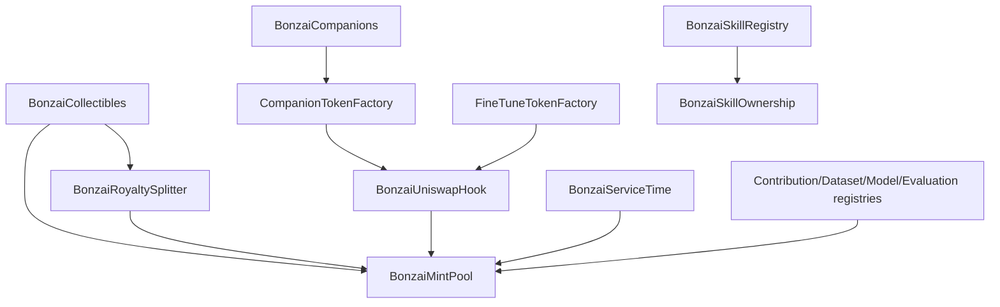

# Smart Contracts

BonzAI contracts are configuration-driven. Do not treat old address tables as universal truth. The app config, deployment scripts, and environment variables are the source of truth for the currently active deployment.

## Core Contracts

| Contract | Purpose |
| --- | --- |
| `BonzaiUnlock` | One-time unlock for all levels, with proceeds split between foundation/treasury and liquidity |
| `BonzaiMintPool` | Epoch-based holder and provider reward pools |
| `BonzaiCollectibles` | Content NFT minting with per-type mint fees, royalties, and collection behavior |
| `BonzaiRoyaltySplitter` | Secondary royalty routing between treasury and pools |
| `BonzaiCompanions` | ERC-721 + ERC-8004 companion identity |
| `BonzaiUniswapHook` | Uniswap V4 afterSwap fee capture for companion/model tokens |
| `CompanionTokenFactory` | Companion ERC-20 launch with V4 liquidity |
| `FineTuneTokenFactory` | Fine-tune/model ERC-20 launch with V4 liquidity |

## P2P And Provider Contracts

| Contract | Purpose |
| --- | --- |
| `BonzaiProviderRegistry` | Provider registration, peer data, supported pipelines, capability metadata |
| `BonzaiServiceTime` | Provider-side service time accounting and MintPool provider reward claims |
| `BonzaiP2PPayment` / payment rails | Older or optional direct payment infrastructure for x402-style paid inference |

The current provider reward documentation should prioritize service-time MintPool rewards rather than presenting x402 ETH/USDC payments as the default.

## Skill And Companion Revenue Contracts

| Contract | Purpose |
| --- | --- |
| `BonzaiSkillRegistry` | Skill purchase/execution marketplace |
| `BonzaiSkillOwnership` | Companion skill co-ownership and weighted revenue distribution |
| `CompanionToken` | ERC-20 token instances launched by the companion factory |

Skill revenue routes 80% to eligible co-owners and 20% to treasury. Companion co-owner weights use BONZAI balance and spending profile score.

## Contribution Economy Contracts

| Contract | Purpose |
| --- | --- |
| `BonzaiContributionRegistry` | Generic contribution records |
| `BonzaiDatasetRegistry` | Dataset identity, hashes, licenses, contributors |
| `BonzaiModelRegistry` | Model/adaptor identity, contributors, revenue routes |
| `BonzaiEvaluationRegistry` | Evaluation/appraisal records and quality signals |

These registries are the onchain layer for Proof-of-Contribution AI. The local Contribution Studio works before a registry deployment is configured.

## Storage

Contracts should store hashes, URIs, rights, routes, and ownership. Large media, metadata, and datasets should be stored offchain through IPFS/Pinata or another configured IPFS-compatible service. BonzAI does not use Irys.

## Cross-Contract Flow

